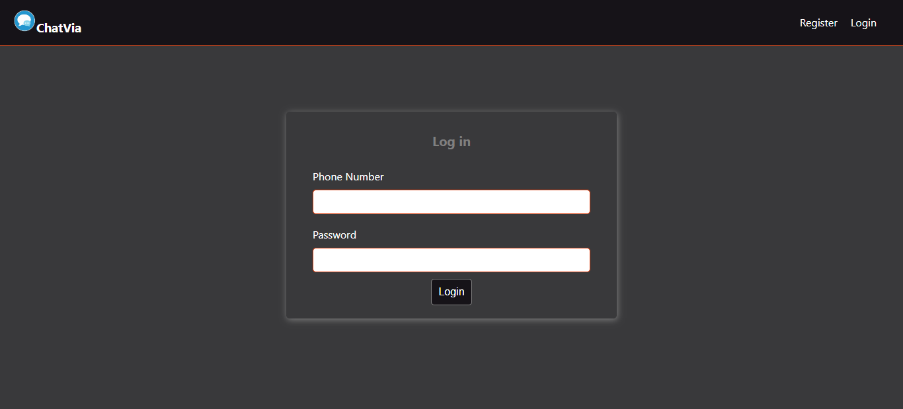

# ChatVia-Your Personal Chat App
ChatVia is an amazing platform for the users to meet and make some new friends! It is a real time chat app developed using ReactJs and the latest Firebase SDK, version 10.

What's special about ChatVia? It is a private chat app that lets you talk to different people without sharing your phone number or any personal information!
Sounds fun? Hop right in and use ChatVia now!!

__ChatVia App__ : https://chat-via.vercel.app/

__Demo of the working project__ : https://drive.google.com/drive/folders/1gmdluGeMonHzBn2TEUEboz3mowfa5KIN?usp=sharing

## How this project was implemented
This project was developed using React as the frontend and Firebase as the backend.

Resorces that helped me learn about the fundamentals and got me started were :
* https://reactjs.org/
* https://firebase.google.com/docs/guides

I started the development by marking down the functionalities that I wanted in ChatVia and basically planned to create a real time private chat app like Omegle but more personalized.
The functionalities I had in mind to be implemented were :
* Ability to retrieve old messages
* User Authentication for login and register
* Messages to be saved, and retrievable later when user logs in again.

I was able to blend in and implement all these functionalities and build the app.
